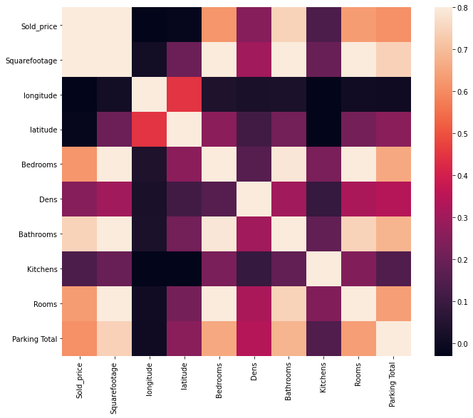
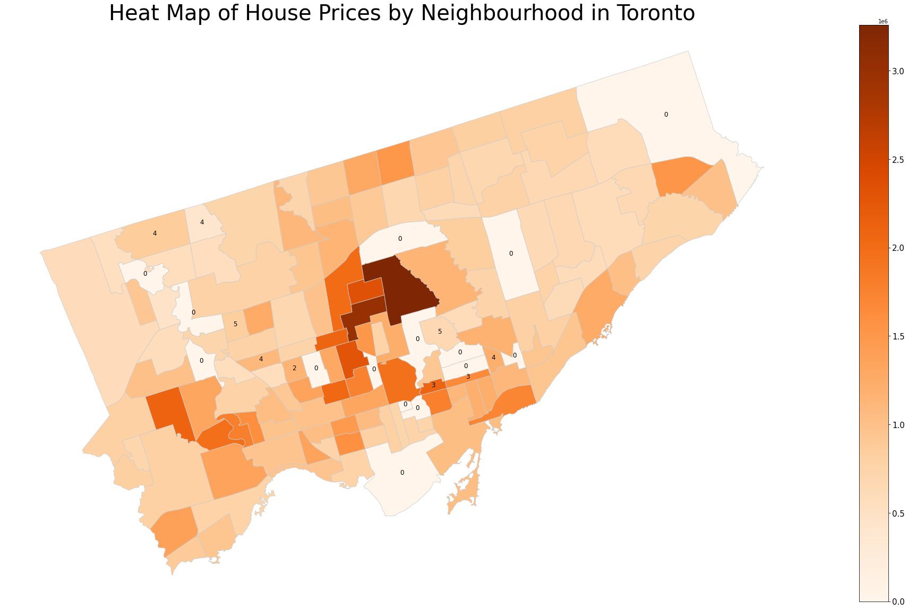
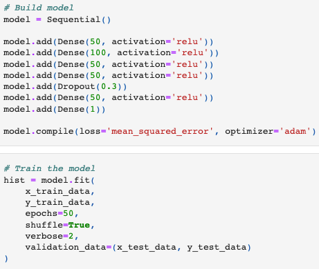
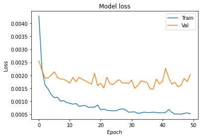
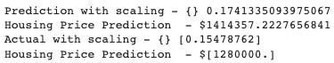

# Toronto Housing Prices Estimator

## Introduction

This project aims to predict the current value of unlisted properties in the Toronto region using a sophisticated multilayer perceptron model that considers over 30 variables. The ultimate goal is to integrate this model into a web application, possibly developed with Python-Flask and React, allowing users to input an address or postal code and receive an estimated property value instantly.

## Data

The dataset encompasses over 14,000 property listings extracted via a Puppeteer web scraper from zolo.com. Additional geolocational data were obtained through latlong.net, with the scraper simulating human interactions to retrieve longitude and latitude details. This comprehensive dataset is stored in a MySQL database for efficient access and manipulation.

### Features

The machine learning model incorporates a diverse set of features to ensure accurate predictions, including but not limited to:

- **Location:** The geographical area of the property.
- **Property Type:** The category of property (e.g., detached, condo, etc.).
- **Nearby Amenities:** Proximity to essential services such as schools and grocery stores.
- **School Rankings:** The quality of educational institutions in the vicinity.

### Visualizations

To better understand the data and its underlying patterns, we have created several visualizations:

- **Correlation Matrix of Features:**  
  

- **Location Data by Region (Heatmap):**  
  

## Neural Network Architecture

The backbone of our prediction model is a carefully designed neural network architecture, visualized below along with its training performance:

- **Model Architecture:**  
  

- **Model Loss Over Training:**  
  

## Results

The model has demonstrated promising results in estimating property values accurately, as illustrated in the following chart:

- **Prediction Results:**  
  

## Conclusion

This project represents a significant step towards automating property valuation in the Toronto area, potentially revolutionizing how property values are assessed and providing valuable insights to homeowners, buyers, and real estate professionals alike.

